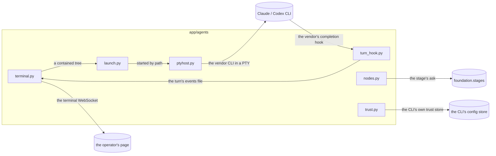

# Main view

One turn, end to end: what starts the agent, what contains it, what ends it, and what the operator sees. The workflow that asked for the turn is not shown — it never reaches in.

```mermaid
flowchart LR
    subgraph pkg["app/agents"]
        terminal["terminal.py"]
        launch["launch.py"]
        ptyhost["ptyhost.py"]
        turn_hook["turn_hook.py"]
        nodes["nodes.py"]
        trust["trust.py"]
    end
    cli_ext[("Claude / Codex CLI")]
    stages_ext[("foundation.stages")]
    store_ext[("the CLI's config store")]
    page_ext[("the operator's page")]
    terminal -->|"a contained tree"| launch
    launch -->|"started by path"| ptyhost
    ptyhost -->|"the vendor CLI in a PTY"| cli_ext
    cli_ext -->|"the vendor's completion hook"| turn_hook
    turn_hook -->|"the turn's events file"| terminal
    nodes -->|"the stage's ask"| stages_ext
    trust -->|"the CLI's own trust store"| store_ext
    terminal -->|"the terminal WebSocket"| page_ext
```
