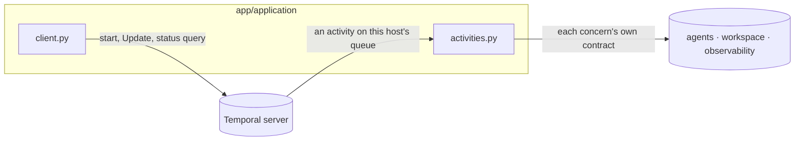

# Main view

The two ways in: what Temporal asks this host to do, and what a human asks of a run. Everything below is composed, not reimplemented.

```mermaid
flowchart LR
    subgraph pkg["app/application"]
        activities["activities.py"]
        client["client.py"]
    end
    temporal_ext[("Temporal server")]
    concerns_ext[("agents · workspace · observability")]
    activities -->|"each concern's own contract"| concerns_ext
    client -->|"start, Update, status query"| temporal_ext
    temporal_ext -->|"an activity on this host's queue"| activities
```
