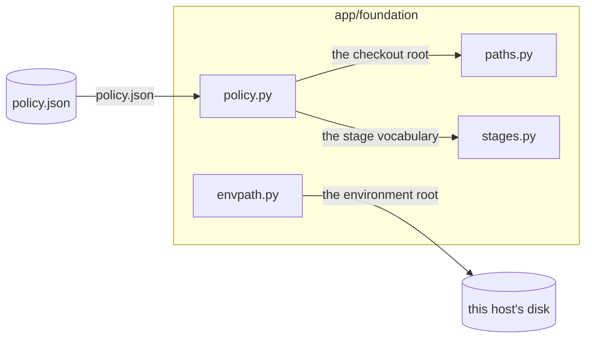

# Main view

The facts this package answers and where each reads them from. Nothing here imports another concern.

```mermaid
flowchart LR
    subgraph pkg["app/foundation"]
        paths["paths.py"]
        envpath["envpath.py"]
        policy["policy.py"]
        stages["stages.py"]
    end
    repos_ext[("policy.json")]
    hostfs[("this host's disk")]
    policy -->|"the stage vocabulary"| stages
    policy -->|"the checkout root"| paths
    repos_ext -->|"policy.json"| policy
    envpath -->|"the environment root"| hostfs
```
