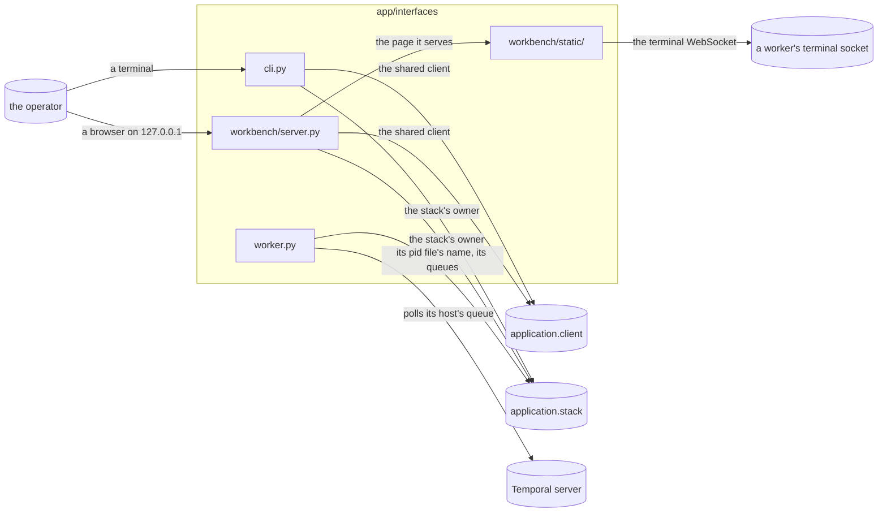

# Main view

The three ways in and what each speaks to. Every arrow leaves this package; none arrives from inside the source.

```mermaid
flowchart LR
    subgraph pkg["app/interfaces"]
        cli["cli.py"]
        worker["worker.py"]
        server["workbench/server.py"]
        static["workbench/static/"]
    end
    client_ext[("application.client")]
    stack_ext[("application.stack")]
    temporal_ext[("Temporal server")]
    socket_ext[("a worker's terminal socket")]
    operator_ext[("the operator")]
    cli -->|"the shared client"| client_ext
    server -->|"the shared client"| client_ext
    cli -->|"the stack's owner"| stack_ext
    server -->|"the stack's owner"| stack_ext
    worker -->|"its pid file's name, its queues"| stack_ext
    server -->|"the page it serves"| static
    worker -->|"polls its host's queue"| temporal_ext
    static -->|"the terminal WebSocket"| socket_ext
    operator_ext -->|"a browser on 127.0.0.1"| server
    operator_ext -->|"a terminal"| cli
```
