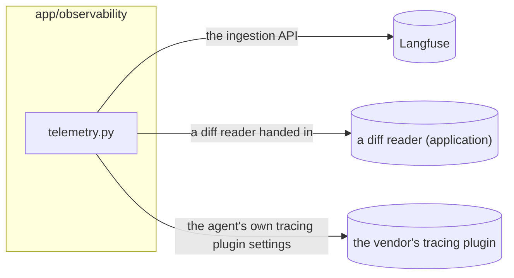

# Main view

One module, three things it speaks to, and no arrow coming back. What it cannot do is as much the point as what it can.

```mermaid
flowchart LR
    subgraph pkg["app/observability"]
        telemetry["telemetry.py"]
    end
    langfuse_ext[("Langfuse")]
    reader_ext[("a diff reader (application)")]
    plugin_ext[("the vendor's tracing plugin")]
    telemetry -->|"the ingestion API"| langfuse_ext
    telemetry -->|"a diff reader handed in"| reader_ext
    telemetry -->|"the agent's own tracing plugin settings"| plugin_ext
```
