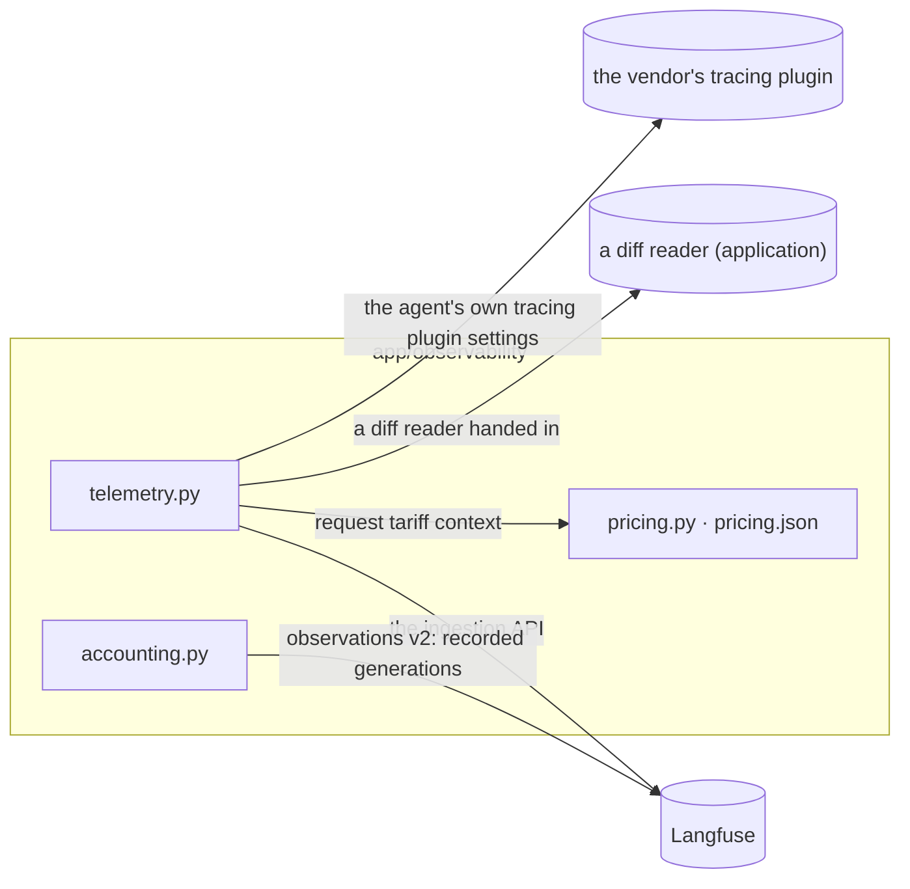

# Main view

Trace writes and an optional recorded-cost display share Langfuse. Neither supplies workflow decisions.

```mermaid
flowchart LR
    subgraph pkg["app/observability"]
        telemetry["telemetry.py"]
        pricing["pricing.py · pricing.json"]
        accounting["accounting.py"]
    end
    langfuse_ext[("Langfuse")]
    reader_ext[("a diff reader (application)")]
    plugin_ext[("the vendor's tracing plugin")]
    telemetry -->|"the ingestion API"| langfuse_ext
    telemetry -->|"request tariff context"| pricing
    accounting -->|"observations v2: recorded generations"| langfuse_ext
    telemetry -->|"a diff reader handed in"| reader_ext
    telemetry -->|"the agent's own tracing plugin settings"| plugin_ext
```
