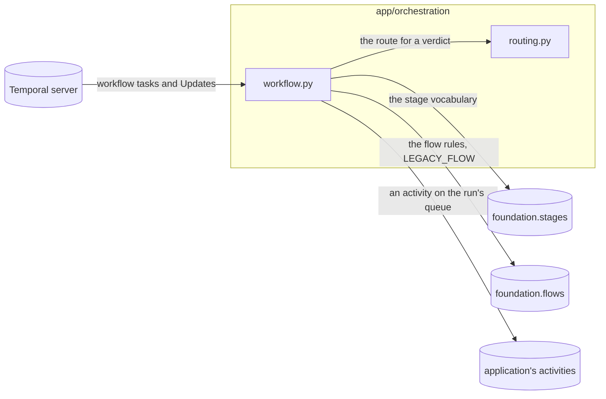

# Main view

What decides a run's next step, and the two things it speaks to. No effect crosses this boundary except as a named activity.

```mermaid
flowchart LR
    subgraph pkg["app/orchestration"]
        workflow["workflow.py"]
        routing["routing.py"]
    end
    temporal_ext[("Temporal server")]
    stages_ext[("foundation.stages")]
    flows_ext[("foundation.flows")]
    activity_ext[("application's activities")]
    workflow -->|"the route for a verdict"| routing
    workflow -->|"the stage vocabulary"| stages_ext
    workflow -->|"the flow rules, LEGACY_FLOW"| flows_ext
    temporal_ext -->|"workflow tasks and Updates"| workflow
    workflow -->|"an activity on the run's queue"| activity_ext
```
