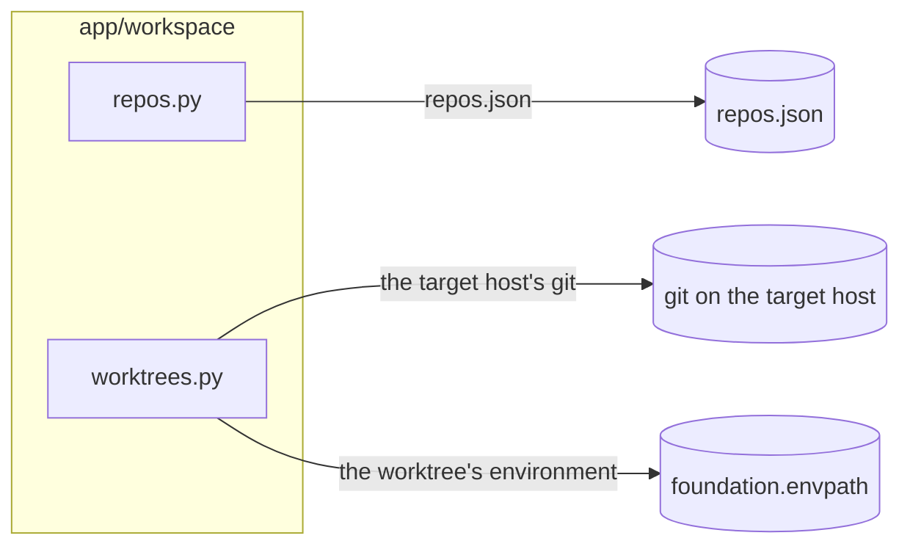

# Main view

The two facts a run needs about code: which repository, and the worktree it changes. Both answered on the target host, with that host's own git.

```mermaid
flowchart LR
    subgraph pkg["app/workspace"]
        repos["repos.py"]
        worktrees["worktrees.py"]
    end
    descriptors_ext[("repos.json")]
    git_ext[("git on the target host")]
    envpath_ext[("foundation.envpath")]
    repos -->|"repos.json"| descriptors_ext
    worktrees -->|"the target host's git"| git_ext
    worktrees -->|"the worktree's environment"| envpath_ext
```
