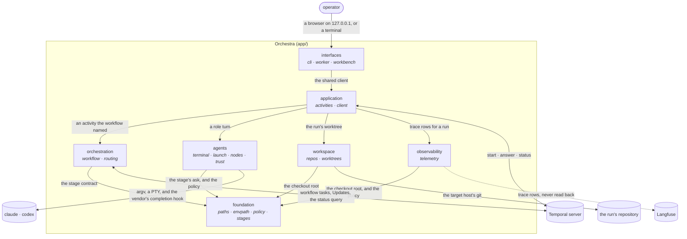

# Main view

Orchestra's parts at its own level — one box per concern under `app/`, each linked to its own
architecture — and the participants outside it. Which process each part runs in is
[the processes view](processes.md); the stops a run can reach are [the stops view](stops.md).
Nothing inside a part is drawn here; that belongs to the part's own main view.

Every arrow between two parts inside the box is an import the boundary check enforces; the table
it enforces is in [structure.md](../structure.md#relationships-and-dependency-direction), and
`tests/test_architecture.py` fails on an import this picture does not show.

| part | its own architecture |
|---|---|
| foundation | [app/foundation](../../../app/foundation/docs/architecture/README.md) |
| orchestration | [app/orchestration](../../../app/orchestration/docs/architecture/README.md) |
| workspace | [app/workspace](../../../app/workspace/docs/architecture/README.md) |
| agents | [app/agents](../../../app/agents/docs/architecture/README.md) |
| observability | [app/observability](../../../app/observability/docs/architecture/README.md) |
| application | [app/application](../../../app/application/docs/architecture/README.md) |
| interfaces | [app/interfaces](../../../app/interfaces/docs/architecture/README.md) |
