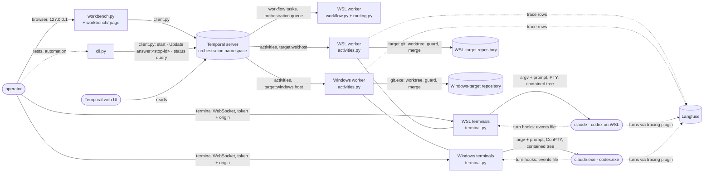
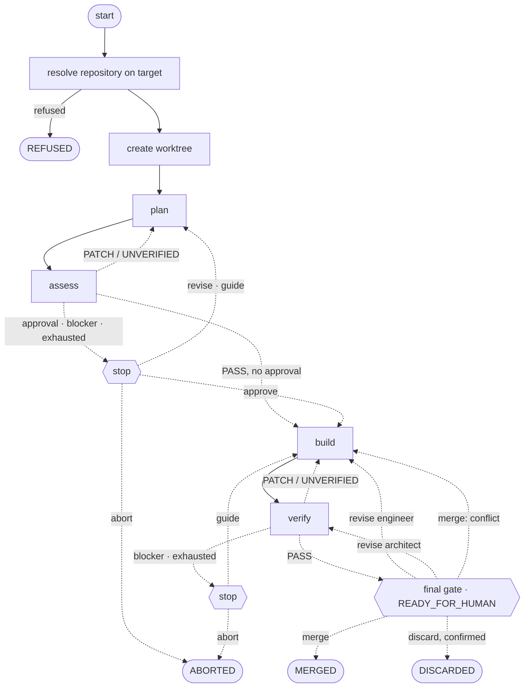

# Main view

The parts of Orchestra, the service and processes they run in, and the contract each
relationship goes through. Topology only: what a stage asks for, what a verdict means and what an
answer does are in [structure.md](../structure.md).

The workflow's stops, in the order a run can reach them:

Any stage, the worktree's creation, a merge or a discard that fails stops at a `failed` stop, whose
`continue` runs that step once more and whose `abort` ends the run.
