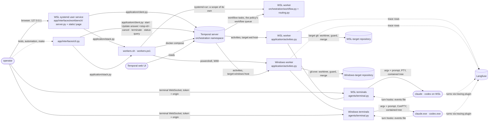

# Processes

Which process each part runs in, on which host, and the contract each relationship goes through.
Topology only: what a stage asks for, what a verdict means and what an answer does are in
[structure.md](../structure.md). Which package owns which module is [the main view](main.md).

Each host runs its own worker and polls its own task queue (D23), so a repository that must build
on Windows gets Windows agents and a Linux-only repository gets WSL agents — from one checkout. The
Workbench runs apart from the stack it starts and stops (D32): a restart of its service never takes
a worker.
