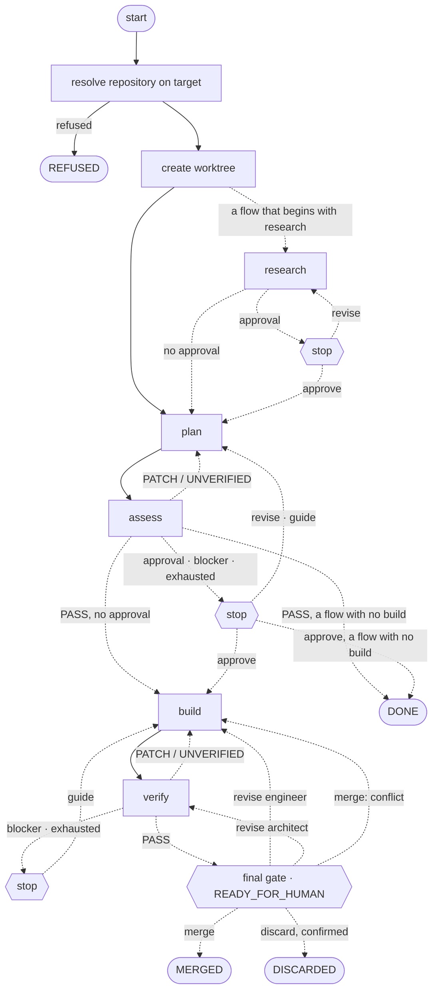

# Stops

Every stop a run can reach, and what each answer does to it. What a verdict means is
[the architect's own file](../../../roles/architect.md); which process decides a transition is
[the processes view](processes.md).

This is the default flow, `engineer-code`, with the stops a run's flow may add or leave out
([structure D13](../structure.md)): research first, whose brief waits at an approval; an approval
the flow does not schedule, or one *skip approvals* skips, going straight on; and a flow with no build
ending `DONE`, its worktree kept, where this one reaches the final gate.

Any stage, the worktree's creation, a merge or a discard that fails stops at a `failed` stop, whose
`continue` runs that step once more — a git step no worker of its host took within the policy's
heartbeat interval too, never having run.

A Stop ends the run `STOPPED` from any of these places and runs no git; a worktree's creation, a
merge or a discard already running finishes first, and a merge or discard that landed ends the run
as above. Force terminate closes it at once, and a git side effect already running goes on
regardless. Both are [structure D31](../structure.md).
