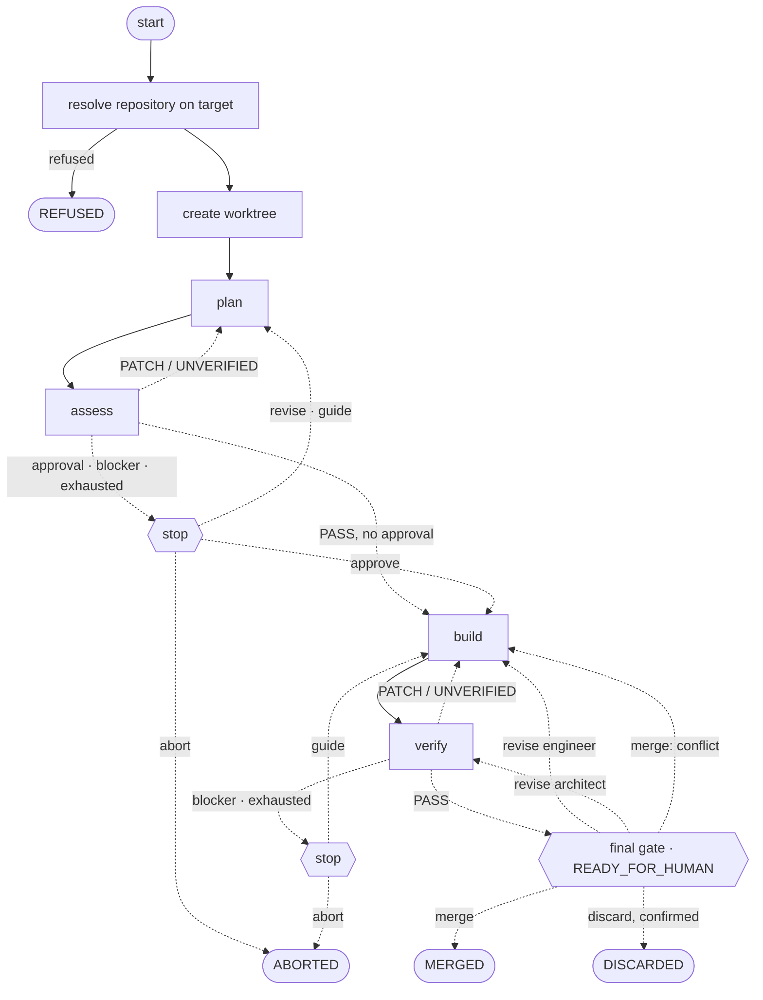

# Stops

Every stop a run can reach, and what each answer does to it. What a verdict means is
[the architect's own file](../../../roles/architect.md); which process decides a transition is
[the processes view](processes.md).

Any stage, the worktree's creation, a merge or a discard that fails stops at a `failed` stop, whose
`continue` runs that step once more and whose `abort` ends the run.
